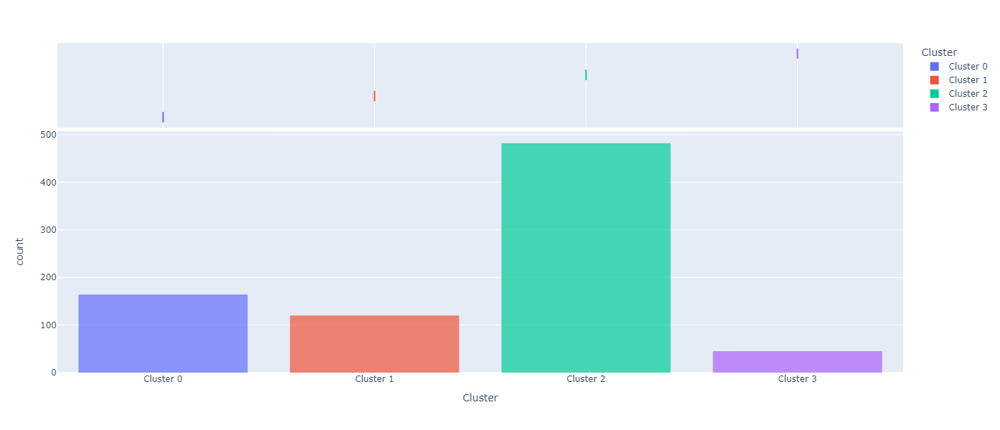
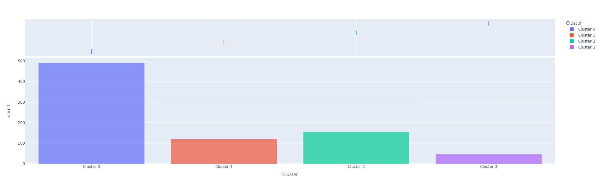
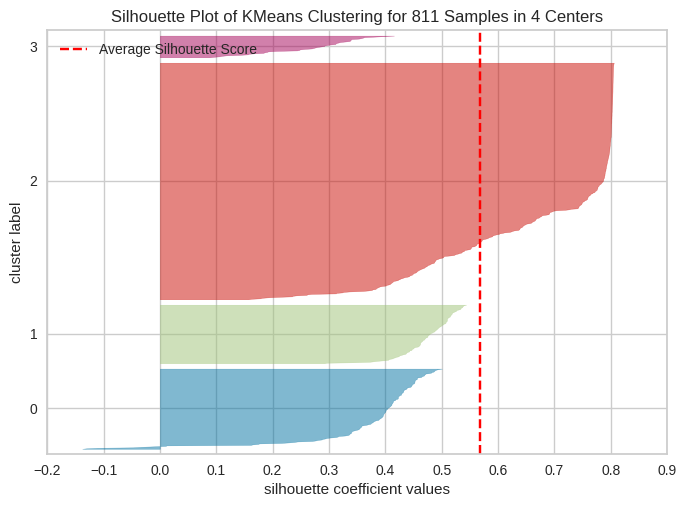
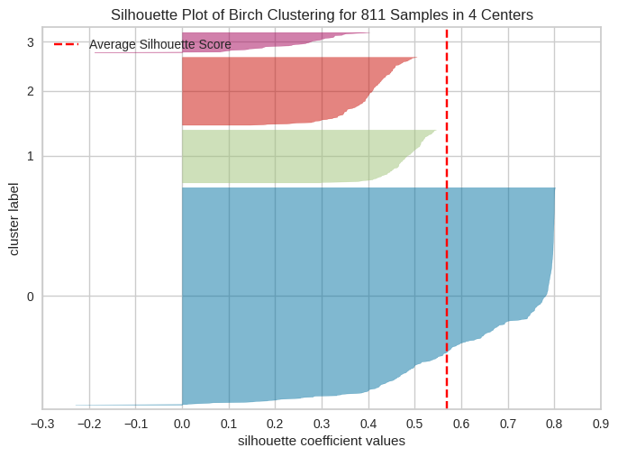
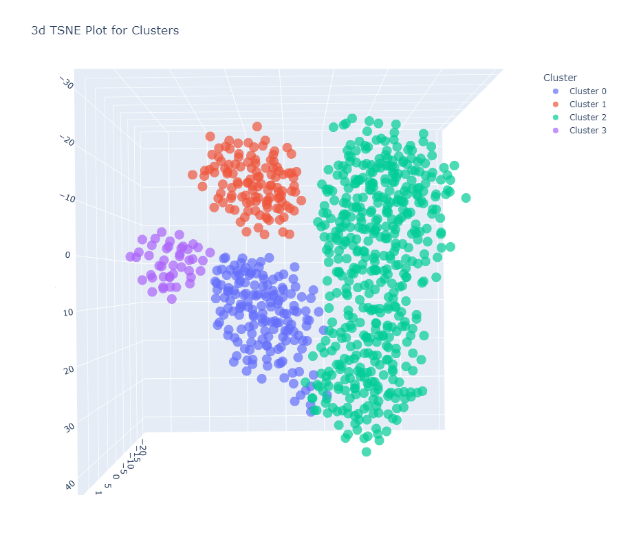
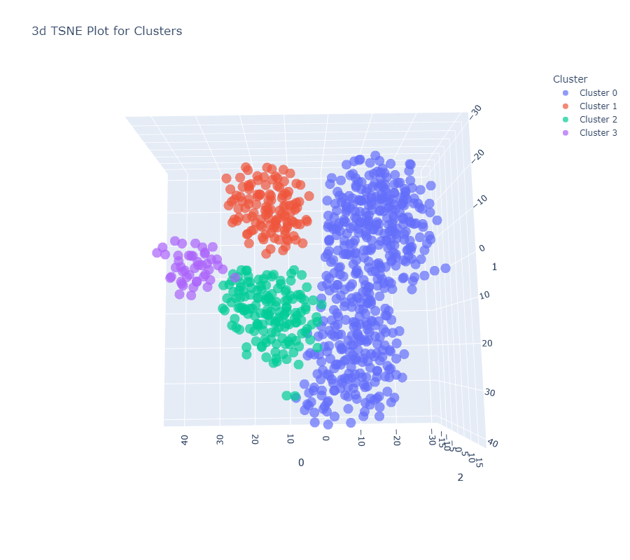
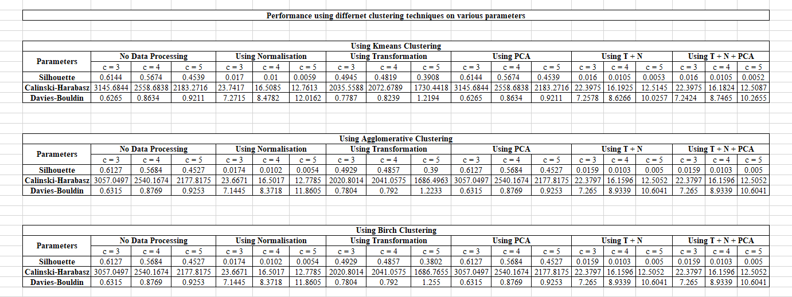

# Clustering Assignment using Pycaret
This repository contains the implementation of different clustering algorithms on the sales-transaction dataset using PyCaret. The goal is to explore the performance of clustering techniques with various pre-processing methods and evaluate them on different metrics.

## Dataset
This dataset has been picked from 
[UCI Library](https://archive.ics.uci.edu/dataset/396/sales+transactions+dataset+weekly).
This dataset contains weekly purchased quantities of over 800 products over 52 weeks. Normalised values were removed manually.

## Clustering Techniques
1. KMeans
2. Agglomerative
3. Birch

## Evaluation Parameters
The clustering techniques are evaluated based on the following parameters:

1. Silhouette Score
2. Calinski-Harabasz Index
3. Davies-Bouldin Index

## Pre-Processing techniques used are:

1. Normalization
2. Transformation
3. PCA (Principal Component Analysis)
4. Normalization + Transformation
5. Normalization + Transformation + PCA

## Graphs
1. Distribution
   - KMeans
 
     
    
   - Agglomerative
 
     
    
   - Birch
 
     
    
2. Silhouette
   - KMeans
 
     
    
   - Birch

     

3. TSNE
   - KMeans
 
     
    
   - Agglomerative
 
     
    
   - Birch
 
     

## Result Tables

  

## Best Algorithm
The best algorithm to cluster sales-transaction dataset is ***KMeans Clustering*** method as it has the highest Silhouette score without pre-processing techniques.
